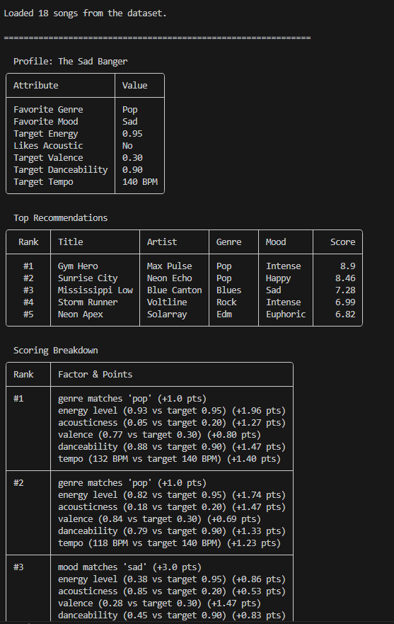
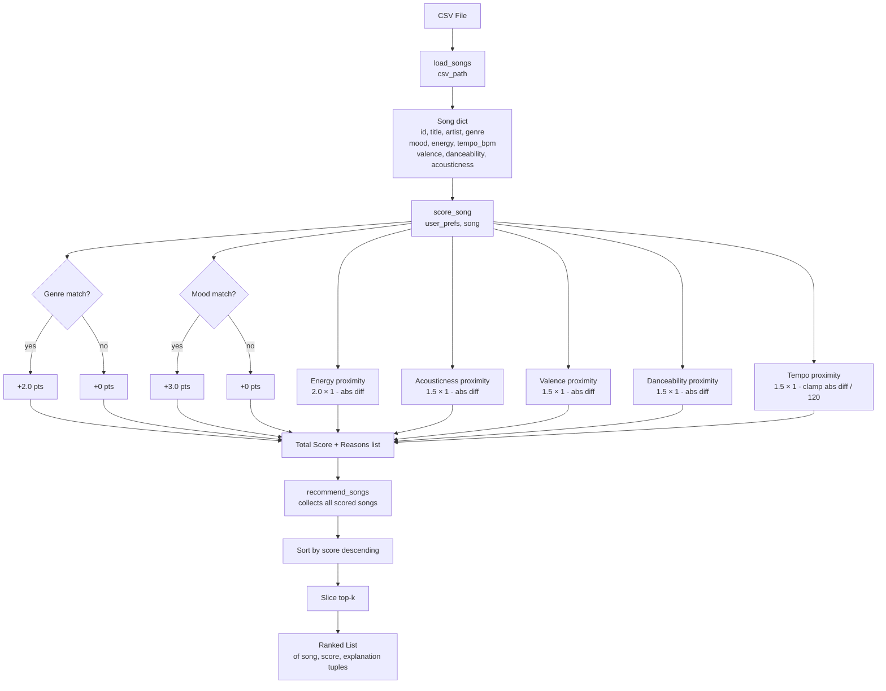
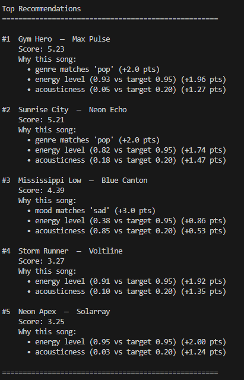
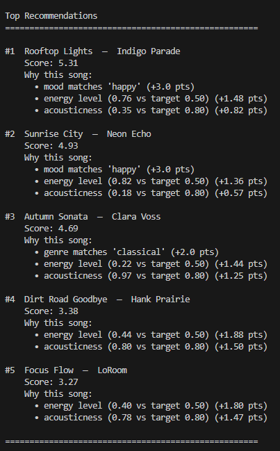
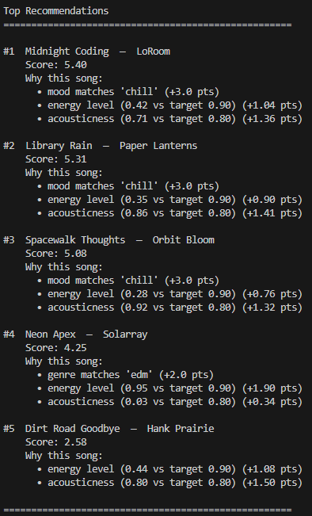
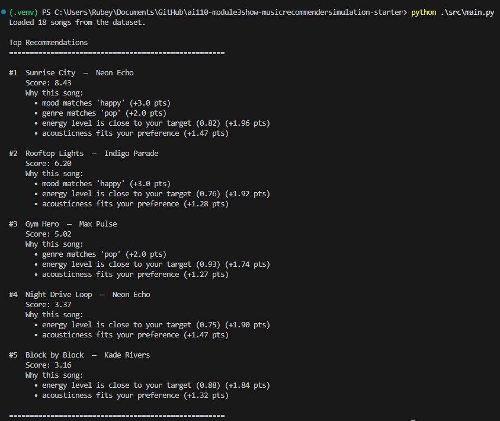

# 🎵 Music Recommender Simulation

## Project Summary

In this project you will build and explain a small music recommender system.

Your goal is to:

- Represent songs and a user "taste profile" as data
- Design a scoring rule that turns that data into recommendations
- Evaluate what your system gets right and wrong
- Reflect on how this mirrors real world AI recommenders

This version builds a rule-based music recommender that scores each song in a catalog against a user's taste profile across four attributes — genre, mood, energy level, and acoustic preference — then returns the top-ranked matches. The scoring weights mood most heavily, followed by genre, energy proximity, and acousticness. To stress-test the system, three adversarial user profiles were designed to expose cases where conflicting signals produce counterintuitive results, revealing how small weight differences can silently override a user's most explicit preferences.



---

## How The System Works


Each song in the catalog is described by ten attributes: a unique ID, title, artist, genre, mood, energy level, tempo, valence, danceability, and acousticness. All numeric attributes are factored into the score.

A user is represented by a taste profile with seven preferences: favorite genre, favorite mood, target energy, acoustic preference, target valence, target danceability, and target tempo.

When a recommendation is requested, every song is scored against that profile. The score is the sum of seven independent signals:

| Signal | Max points | How it's calculated |
|---|---|---|
| **Mood (M)** | 3.0 | Exact match between song mood and user's favorite mood |
| **Genre (G)** | 2.0 | Exact match between song genre and user's favorite genre |
| **Energy** | 2.0 | `2.0 × (1 − |song_energy − target_energy|)` |
| **Acousticness** | 1.5 | `1.5 × (1 − |song_acousticness − target|)` where target is 0.8 (likes acoustic) or 0.2 (doesn't) |
| **Valence** | 1.5 | `1.5 × (1 − |song_valence − target_valence|)` |
| **Danceability** | 1.5 | `1.5 × (1 − |song_danceability − target_danceability|)` |
| **Tempo** | 1.5 | `1.5 × (1 − min(|song_tempo − target_tempo| / 120, 1.0))` |

The songs are then sorted from highest to lowest score and the top-k are returned as recommendations. The maximum possible score is **13.0 points**.

Real-world systems like Spotify and YouTube use two broader approaches:

- **Content-Based Filtering** — recommending songs based on similar attributes like genre and tempo
- **Collaborative Filtering** — recommending songs that users with similar tastes have liked ("users like you also listened to...")

This system implements a simplified version of content-based filtering with fixed weights.

**Potential biases to be aware of:**

- Mood carries the most weight (3 pts), so a perfect mood match can push a song to the top even if all other signals are weak.
- Genre and mood are exact-match only — a "pop" fan scores 0 for "indie pop", even if those songs would be a great fit in practice.
- The acoustic preference is treated as a hard yes/no, mapping to fixed targets of 0.8 or 0.2 regardless of how strongly the user feels about it.
- Valence, danceability, and tempo default to the midpoint (0.5 / 120 BPM) if not specified, so they can silently penalize songs at the extremes for users who never set those preferences.


| Profile | Signals in conflict | Expected result | Actual result | Weakness exposed |
|---|---|---|---|---|
| Sad Banger | `favorite_mood: "sad"` vs `favorite_genre: "pop"` + `target_energy: 0.95` | Sad, slow song (Mississippi Low) | Energetic pop (Gym Hero) | Mood (+3.0) can be beaten by genre (+2.0) + strong energy proximity (~+2.0) combined |
| Classical Happy Fan | `favorite_genre: "classical"` vs `favorite_mood: "happy"` | Classical song (Autumn Sonata) | Pop/indie (Rooftop Lights) | When genre and mood never co-occur in the catalog, the higher-weighted attribute (mood +3.0 > genre +2.0) silently wins every time |
| Acoustic Raver | `favorite_genre: "edm"` + `target_energy: 0.9` vs `favorite_mood: "chill"` + `likes_acoustic: True` | High-energy EDM (Neon Apex) | Lofi/chill (Midnight Coding) | `likes_acoustic` and `favorite_mood` compound — both independently favor the same low-energy acoustic songs, overriding the numeric energy signal |

---

## Getting Started

### Setup

1. Create a virtual environment (optional but recommended):

   ```bash
   python -m venv .venv
   source .venv/bin/activate      # Mac or Linux
   .venv\Scripts\activate         # Windows

2. Install dependencies

```bash
pip install -r requirements.txt
```

3. Run the app:

```bash
python -m src.main
```

### Running Tests

Run the starter tests with:

```bash
pytest
```

You can add more tests in `tests/test_recommender.py`.

---

## Experiments You Tried

Use this section to document the experiments you ran. For example:

- What happened when you changed the weight on genre from 2.0 to 0.5
- What happened when you added tempo or valence to the score
- How did your system behave for different types of users

I tried to double the weight on the energy level to see what would happen but it didn't do anything to the top recommendation. Additionally, I tried adding tempo and valence to the scoring algorithm but it seem that the basic parameters that I first implemented outweigh the effects of tempo and valence. 

A summary of the what I tried (prior to add tempo, valence and dancibility to the score):

| Profile | Signals in conflict | Expected result | Actual result | Weakness exposed |
|---|---|---|---|---|
| Sad Banger | `favorite_mood: "sad"` vs `favorite_genre: "pop"` + `target_energy: 0.95` | Sad, slow song (Mississippi Low) | Energetic pop (Gym Hero) | Mood (+3.0) can be beaten by genre (+2.0) + strong energy proximity (~+2.0) combined |
| Classical Happy Fan | `favorite_genre: "classical"` vs `favorite_mood: "happy"` | Classical song (Autumn Sonata) | Pop/indie (Rooftop Lights) | When genre and mood never co-occur in the catalog, the higher-weighted attribute (mood +3.0 > genre +2.0) silently wins every time |
| Acoustic Raver | `favorite_genre: "edm"` + `target_energy: 0.9` vs `favorite_mood: "chill"` + `likes_acoustic: True` | High-energy EDM (Neon Apex) | Lofi/chill (Midnight Coding) | `likes_acoustic` and `favorite_mood` compound — both independently favor the same low-energy acoustic songs, overriding the numeric energy signal |

**Sad Banger profile results:**



**Classical Happy Fan profile results:**



**Acoustic Raver profile results:**



**Overall recommendations output:**



---

## Limitations and Risks

- **Tiny catalog** — the system only scores songs in a fixed CSV; it cannot discover or generalize to music outside that list
- **Exact-match only** — genre and mood are string comparisons, so "indie pop" scores zero for a "pop" fan even when the songs are nearly identical in feel
- **Ignored attributes** — tempo, valence, and danceability are stored but never used, meaning two very different-sounding songs can receive the same score
- **Mood dominance** — mood carries the largest weight (3 pts), so a strong mood match can outrank songs that are a much better overall fit
- **Binary acoustic preference** — the system treats acoustic preference as a hard yes/no rather than a spectrum, which over-rewards or under-rewards acoustic songs
- **No personalization over time** — there is no feedback loop; the system cannot learn from what a user actually plays or skips

More details about limitations is in the model card.

---

## Reflection

Read and complete `model_card.md`:

[**Model Card**](model_card.md)

Write 1 to 2 paragraphs here about what you learned:

- about how recommenders turn data into predictions
- about where bias or unfairness could show up in systems like this


---

## 7. `model_card_template.md`

Combines reflection and model card framing from the Module 3 guidance. :contentReference[oaicite:2]{index=2}  

```markdown
# 🎧 Model Card - Music Recommender Simulation

## 1. Model Name

Give your recommender a name, for example:

> VibeFinder 1.0

---

## 2. Intended Use

- What is this system trying to do
- Who is it for

Example:

> This model suggests 3 to 5 songs from a small catalog based on a user's preferred genre, mood, and energy level. It is for classroom exploration only, not for real users.

---

## 3. How It Works (Short Explanation)

Describe your scoring logic in plain language.

- What features of each song does it consider
- What information about the user does it use
- How does it turn those into a number

Try to avoid code in this section, treat it like an explanation to a non programmer.

---

## 4. Data

Describe your dataset.

- How many songs are in `data/songs.csv`
- Did you add or remove any songs
- What kinds of genres or moods are represented
- Whose taste does this data mostly reflect

---

## 5. Strengths

Where does your recommender work well

You can think about:
- Situations where the top results "felt right"
- Particular user profiles it served well
- Simplicity or transparency benefits

---

## 6. Limitations and Bias

Where does your recommender struggle

Some prompts:
- Does it ignore some genres or moods
- Does it treat all users as if they have the same taste shape
- Is it biased toward high energy or one genre by default
- How could this be unfair if used in a real product

---

## 7. Evaluation

How did you check your system

Examples:
- You tried multiple user profiles and wrote down whether the results matched your expectations
- You compared your simulation to what a real app like Spotify or YouTube tends to recommend
- You wrote tests for your scoring logic

You do not need a numeric metric, but if you used one, explain what it measures.

---

## 8. Future Work

If you had more time, how would you improve this recommender

Examples:

- Add support for multiple users and "group vibe" recommendations
- Balance diversity of songs instead of always picking the closest match
- Use more features, like tempo ranges or lyric themes

---

## 9. Personal Reflection

A few sentences about what you learned:

- What surprised you about how your system behaved
- How did building this change how you think about real music recommenders
- Where do you think human judgment still matters, even if the model seems "smart"

